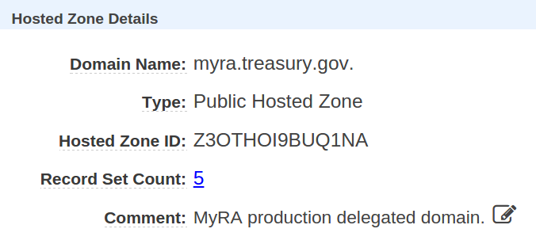
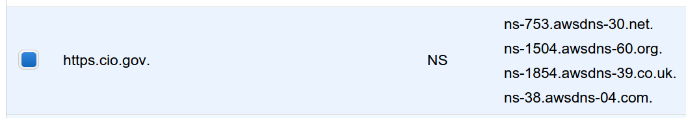

## Setting up HTTPS at 18F

Most importantly:

**18F issues and manages the TLS certificates for all projects we host.**

Exceptions should be very rare, and for a very good reason. If we cannot issue and reissue our own TLS certificates for an application, then we cannot control whether the site remains available to visitors, and we cannot control the very first interaction any visiting browser or client has with that application.

### Certificates over the command line

We currently use a CLI-based certificate issuer — **[SSLMate](https://sslmate.com)** — to issue TLS certificates in a rapid, flexible, manageable way.

You will need to obtain **login credentials** from DevOps, and you should treat those credentials as you would any other production credentials at 18F.

18F DevOps has made a bulk purchase of certificates, so you now _do not_ require pre-approval from DevOps and Operations to obtain one.

Buy single-domain certificates as needed. However, please consult with DevOps before purchasing a wildcard certificate (e.g. `*.18f.gov`), as they are on the expensive side.

If you've already installed and set up SSLMate, [skip ahead to the purchasing instructions](#set-up-the-domain)

### Install SSLMate

In OS X, install SSLMate through [homebrew](http://brew.sh):

```bash
brew install sslmate
```

In Ubuntu 14.04 LTS, install SSLMate through `apt`:

```bash
wget -P /etc/apt/sources.list.d https://sslmate.com/apt/ubuntu1404/sslmate.list
wget -P /etc/apt/trusted.gpg.d https://sslmate.com/apt/ubuntu1404/sslmate.gpg
apt-get update
apt-get install sslmate
```

For other operating systems or Ubuntu versions, see [installation instructions](https://sslmate.com/help/getting_started#install).

### Log into SSLMate

You'll need to get the SSLMate password from the DevOps team. Treat this password as you would any other production system credential at 18F.

To log your client into 18F's SSLMate account, run `sslmate link` and enter the credentials:

```
$  sslmate link
If you don't have an account yet, visit https://sslmate.com/signup
Enter your SSLMate username: 18F-DevOps
Enter your SSLMate password: *
Linking account... Done.
```

### Set up the domain

The domain or subdomain should be **fully delegated to 18F.** This means that 18F can administer the DNS for the domain in our own Route 53 infrastructure.

* Create a "Hosted Zone" in Route 53 for the given domain or subdomain, e.g. `analytics.usa.gov`. (Amazon will add the trailing dot for you.)



* Amazon will then automatically generate 4 nameserver addresses.



* Provide those 4 nameserver addresses to the holder of the parent domain.
* Tell the parent domain to set **4 NS records** -- one for each of the above nameservers. The parent domain should _not_ set an SOA record.

* Note: **You must include the trailing dot in the NS records that you provide.**
* Note: If you're delegating the DNS for an existing subdomain that's already in production use, you may want to take extra precautions when changing the NS records (since invalid NS records can leave the domain inaccessible). If possible, you may consider rolling out DNS changes out to an internal organization first, double checking things, and then rolling the DNS changes out to the public.

You can also refer to the [official documentation](http://docs.aws.amazon.com/Route53/latest/DeveloperGuide/CreatingNewSubdomain.html) for delegating a subdomain to Route 53.

### Purchase the certificate

Initiate a certificate purchase for a domain or subdomain. We typically use [DNS approval](https://sslmate.com/help/approval/dns) to validate our ownership over the domain.

```bash
sslmate buy analytics.usa.gov --approval=dns
```

```
============ Order summary ============
     Host Name: analytics.usa.gov
       Product: 1 Year Standard SSL
         Price: $15.95
    Auto-Renew: Yes

=========== Payment details ===========
 Credit Card:  ending in
  Amount Due: $15.95 (USD)

Press ENTER to confirm order (or q to quit):
```

Press Enter to place the order. Real hash values have been replaced with `____` below.

```
Generating private key... Done.
Generating CSR... Done.
Adding DNS approval record for analytics.usa.gov...
Notice: unable to automatically configure DNS approval for analytics.usa.gov: No DNS approval handler available for _________.analytics.usa.gov. or ______.usa.gov.. Specify the --verbose option for details.

Please add one of the following DNS records to your domain's DNS:

    ____________________.analytics.usa.gov. CNAME ____________________.comodoca.com.
    _________________________.usa.gov. CNAME __________________.comodoca.com.

You may remove any DNS record you previously added for this certificate.
You should leave the new DNS record in place as long as this certificate
is in use.

Press ENTER when done (or q to quit): 
```

The SSLMate client will then provide you a DNS record to add. Choose the DNS record that corresponds to the level of the domain which has been delegated to 18F (in the above case, the top-most one, `analytics.usa.gov`).

Add the CNAME record to Route 53, and then hit Enter.

```
Placing order...
Order complete.

Waiting for ownership confirmation...
```

After a long while (it may take several minutes), the SSLMate client will confirm the domain and drop the certificate, certificate chain onto disk, alongside the private key:

```
Your certificate is ready for use!

           Private key file: analytics.usa.gov.key
           Certificate file: analytics.usa.gov.crt
     Certificate chain file: analytics.usa.gov.chain.crt
Certificate with chain file: analytics.usa.gov.chained.crt
```

Note that **the private key was never shared with SSLMate**. It was created locally, and the certificate was what SSLMate created server-side and downloaded to disk.

### Loading the cert into Amazon Web Services

If you're using the certificate with an ELB or with CloudFront, you need to upload the key and cert to AWS.

You'll want to install the [AWS CLI tool](https://aws.amazon.com/cli/), and authorize it with your 18F Amazon Web Services credentials.

##### In an ELB

To upload a certificate for use in an ELB (replace each value with the names and files specific to your cert):

```bash
aws iam upload-server-certificate \
  --server-certificate-name a-new-cert-name \
  --certificate-body file://./your-site.crt \
  --private-key file://./your-site.key \
  --certificate-chain file://./your-site-intermediates.crt
```

**Note:** Refer to [18F's preferred TLS configuration for ELBs](https://github.com/18F/tls-standards/blob/master/configuration/elb.md) when setting up your ELB.

##### In CloudFront

Run the command below. (Replace each value with the names and files specific to your cert.)

Note that the `--path` **must** begin with `/cloudfront/`, and end with a path of your choice and a trailing slash, e.g. `/cloudfront/analytics-production/`.

```bash
aws iam upload-server-certificate \
  --server-certificate-name a-new-cert-name \
  --certificate-body file://./your-site.crt \
  --private-key file://./your-site.key \
  --certificate-chain file://./your-site-intermediates.crt \
  --path /cloudfront/your-path/
```

**Note:** When configuring your CloudFront distribution, force HTTP traffic to be redirected to HTTPS traffic.