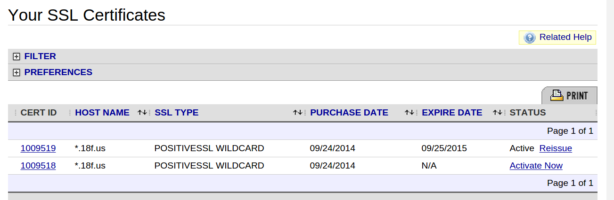
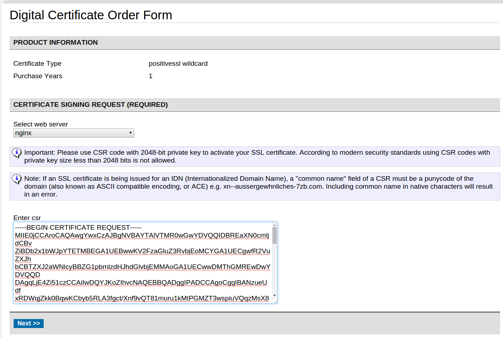
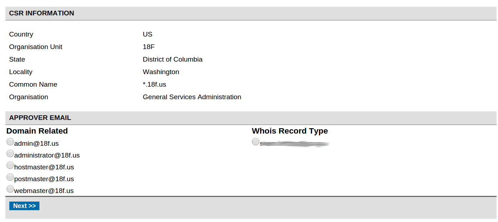
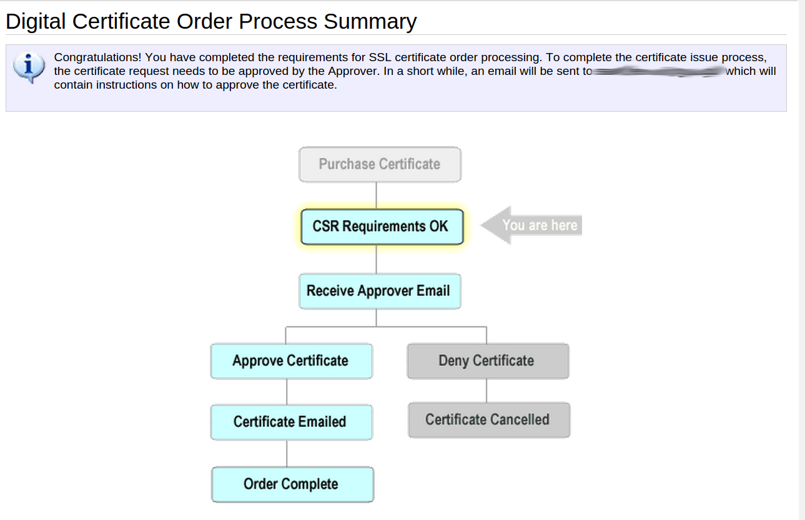

### So you want a new TLS certificate

This is 18F's documentation for their TLS certificate creation, purchase, and installation process. The order of operations is basically:

1. [Generate a new private key](#generating-a-private-key).
2. [Back up that key immediately please!](#backing-up-the-private-key)
3. [Generate a certificate request](#creating-the-certificate-request) for the desired domain.
4. [Purchase a new certificate](#purchasing-the-certificate).
5. [Actually issue the certificate](#actually-getting-the-certificate).
6. [Create the certificate chain](#create-the-certificate-chain).
7. [Install the certificate chain and key](#installing-the-certificate-and-private-key).
8. [Publish the cert and CSR](#publishing-the-certificate-and-csr) in this public repository.

All new 18F TLS certificates should go through this process.

#### Generating a private key

The first step to a new certificate is always to create a new private key. **Every certificate should have its own unique associated private key.**

Our current preferred certificates use [RSA](https://en.wikipedia.org/wiki/RSA_(cryptosystem)) keys with a 2048-bit key length. 

Create an encrypted key with the following command. You will be asked to choose a passphrase which you will use any time you wish to decrypt the key.

```bash
openssl genrsa -aes256 -out your-site-encrypted.key 4096
```

Decrypt the key. You will use the passphrase you picked in the previous command.

```bash
openssl rsa -in your-site-encrypted.key -out your-site.key
```

#### Backing up the private key

Right now, we're just backing up **passphrase-encrypted private keys** in a private S3 bucket. Talk to DevOps for bucket access, and if you need to send the passphrase to someone, use [Fugacious](https://fugacio.us) to do it ephemerally.

This is a **temporary process**, while we work out a more scalable and reasonable key management system.

Encrypt the key again if needed by running:

```bash
openssl rsa -aes256 -in your-site.key -out your-site-encrypted.key
```

Use `s3cmd` or similar to upload the encrypted key to the bucket, in its own directory.

#### Creating the certificate request

Generate the certificate request, signed with SHA-256. You will be asked for details, explained below.

```bash
openssl req -new -sha256 -key your-site.key -out your-site.csr
```

You will be prompted to enter details for the CSR. You will need to fill in the country (US), the State (District of Columbia), the locality (Washington), the organization name (General Services Administration), the unit name (18F), and a blank email.

You will also need to enter a Common Name, which should be the domain name you are getting the certificate issued for. Examples might be `18f.gsa.gov` or `*.18f.us`.

Here's the CSR we used for `https://18f.gsa.gov`:

```
Country Name (2 letter code) [AU]:US
State or Province Name (full name) [Some-State]:District of Columbia
Locality Name (eg, city) []:Washington
Organization Name (eg, company) [Internet Widgits Pty Ltd]:General Services Administration
Organizational Unit Name (eg, section) []:18F
Common Name (e.g. server FQDN or YOUR name) []:18f.gsa.gov
Email Address []:
```

**Make sure to change the Common Name field above to match the domain you are issuing the certificate for.**

This will create a `.csr` file that is suitable for submitting to the CA you are using to issue the certificate.

**Just want a self-signed certificate?**

If you just need a self-signed certificate that **will throw warnings in users' browsers**, you can create the certificate yourself:

```bash
openssl x509 -req -days 365 -in your-site.csr -signkey your-site.key -out your-site.crt
```

`your-site.crt` will be valid for a year, and doesn't need any intermediary certificates.

Then you can skip ahead to [installing the certificate](#installing-the-certificate-and-private-key).

#### Purchasing the certificate

Currently, 18F is using [Namecheap](https://www.namecheap.com/security/ssl-certificates/domain-validation.aspx)'s domain validation certificates for our subdomain and wildcard certificates.

You will need to speak with the 18F DevOps team to confirm the certificate you need, and the 18F Ops team to get purchase approval.

Certificates are purchased _before_ choosing the domain name or submitting the certificate request, so it is possible to purchase certificates before creating the certificate request.

#### Actually getting the certificate

These steps require a teammate with login access to the 18F Namecheap account. The below screenshots show the steps as captured during the creation of our `*.18f.us` wildcard certificate.

Visit the [Namecheap TLS certificates list](https://manage.www.namecheap.com/myaccount/ssl-list.asp). You will see a list of already-created certificates, and any purchased-but-not-yet-created certificates. The below screenshot shows one of each:



To create the certificate, click the "Activate Now" link. On the next page (shown below) select "nginx" for a web server, paste in the contents of the `.csr` file you created earlier, and click "Next".



Verify that the certificate request information is what you expected, and especially that the "Common Name" field shows the correct domain.

We do not currently have any `@18f.us` email addresses set up. You will need to send the approver email to one of the email addresses listed on the `18f.us` WHOIS records. In the screenshot below, this is a particular staff member. For future requests, this will include 18F's public contact alias.



On the next page, you will choose the email address to receive the certificate. **Change this email address to be 18F's public contact address**, as shown below.


After that screen, you should be done, and you should see the lovely flowchart below.



The certificate should be mailed to 18F's public contact email address. In this author's experience, and for reasons unknown, you may have to visit the internal Google Group for this email alias, rather than count on it being correctly forwarded to you.

#### Create the certificate chain

Comodo PositiveSSL will email you a zip file containing the certificate, two intermediate certificates(`COMODORSAAddTrustCA.crt` and `COMODORSADomainValidationSecureServerCA.crt`), and the root certificate (`AddTrustExternalCARoot.crt`). You can _ignore_ the root certificate, it is not needed for our purposes.

Create a certificate chain by concatenating the domain cert and its intermediates:

```bash
cat your-site.crt COMODORSADomainValidationSecureServerCA.crt COMODORSAAddTrustCA.crt > your-site-chain.crt
```

#### Installing the certificate and private key

Where you install the certificate depends on where you are terminating TLS (in other words, the first server a visiting user connects to). Generally speaking, you might need to provide the certificate and key to nginx, or to an Elastic Load Balancer (ELB), or to a CDN (e.g. CloudFront or Cloudflare).

##### In nginx

On 18F's Ubuntu AMI, TLS certificates and keys should go in `/etc/nginx/ssl/keys`. Then update your site's vhost's nginx config to point to your decrypted private key, and your certificate chain.

For a `*.18f.us` domain, that may look like this:

```
ssl_certificate      /etc/nginx/ssl/keys/star.18f.us-chain.crt;
ssl_certificate_key  /etc/nginx/ssl/keys/star.18f.us.key;
```

**Important**: before restarting the server, test out whether the key and certificate have been prepared and installed successfully by running:

```bash
sudo nginx -t
```

If you get no errors, then restart the server:

```bash
sudo service nginx restart
```

##### In an ELB

To use the key and certificate in an ELB in Amazon Web Services:

* First, make a certificate chain that uses **only** the intermediates. The intermediates can be found in [`sites/`](../sites/).

```bash
cat COMODORSADomainValidationSecureServerCA.crt COMODORSAAddTrustCA.crt > your-site-intermediates.crt
```

Then, use the [AWS CLI tool](https://aws.amazon.com/cli/), and run the following command. (Replace each value with the names and files specific to your cert.)

```bash
aws iam upload-server-certificate \
  --server-certificate-name a-new-cert-name \
  --certificate-body file://./your-site.crt \
  --private-key file://./your-site.key \
  --certificate-chain file://./your-site-intermediates.crt
```

Make sure to refer to [18F's preferred TLS configuration for ELBs](https://github.com/18F/tls-standards/blob/master/configuration/elb.md) when setting up your ELB.

##### In CloudFront

Similar to making an ELB, but a slightly different upload command.

To use the key and certificate in CloudFront in Amazon Web Services:

* First, make a certificate chain that uses **only** the intermediates. The intermediates can be found in [`sites/`](../sites/).

```bash
cat COMODORSADomainValidationSecureServerCA.crt COMODORSAAddTrustCA.crt > your-site-intermediates.crt
```

Then, use the [AWS CLI tool](https://aws.amazon.com/cli/), and run the following command. (Replace each value with the names and files specific to your cert.) The `--path` **must** begin with `/cloudfront/`, and end with a path of your choice and a trailing slash, e.g. `/cloudfront/myra-production/`.

```bash
aws iam upload-server-certificate \
  --server-certificate-name a-new-cert-name \
  --certificate-body file://./your-site.crt \
  --private-key file://./your-site.key \
  --certificate-chain file://./your-site-intermediates.crt \
  --path /cloudfront/your-path/
```

Make sure that when configuring your CloudFront distribution, you force HTTP traffic to be redirected to HTTPS traffic.


#### Publishing the certificate and CSR

We record our certificates and CSRs in a public directory, for ease of management and versioning. Certificate and CSR information is insensitive, and is less easily lost when put in a public repository.

When you are done obtaining a certificate, installing it, and verifying that it's working, publish the following files into `sites/`:

* The certificate request (`.csr`) file.
* The certificate (`.crt`) for the domain.
* The full certificate chain (`.crt`) for the domain and its intermediates.
* A `README.md` containing why the cert was bought, and who purchased it when.

For an example, see [`sites/star.18f.us`](sites/star.18f.us).

#### Resources

* https://konklone.com/post/switch-to-https-now-for-free
* https://bettercrypto.org/static/applied-crypto-hardening.pdf
* http://support.f5.com/kb/en-us/solutions/public/11000/400/sol11440.html
